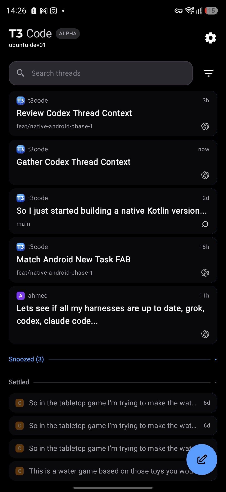
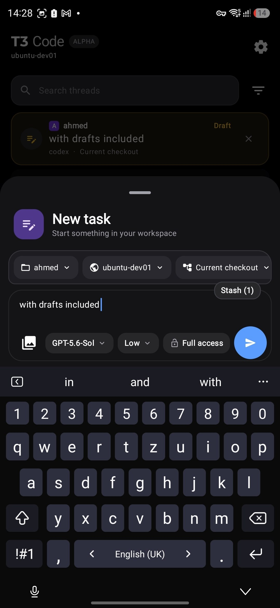
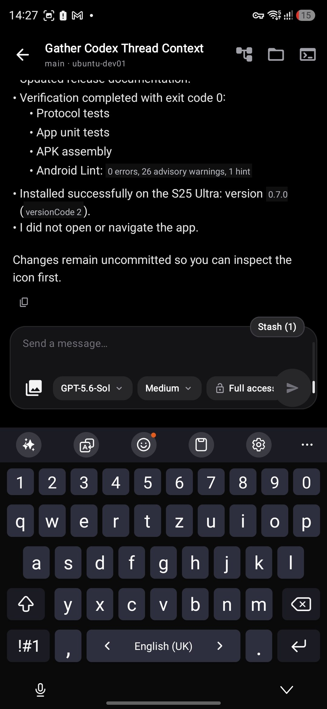
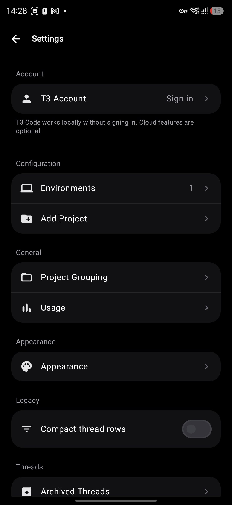
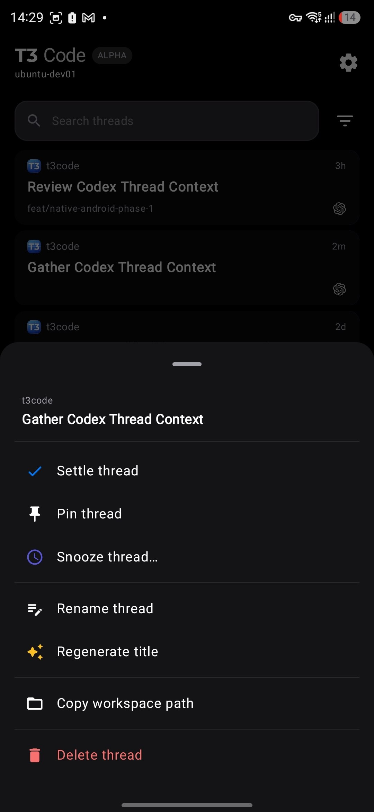
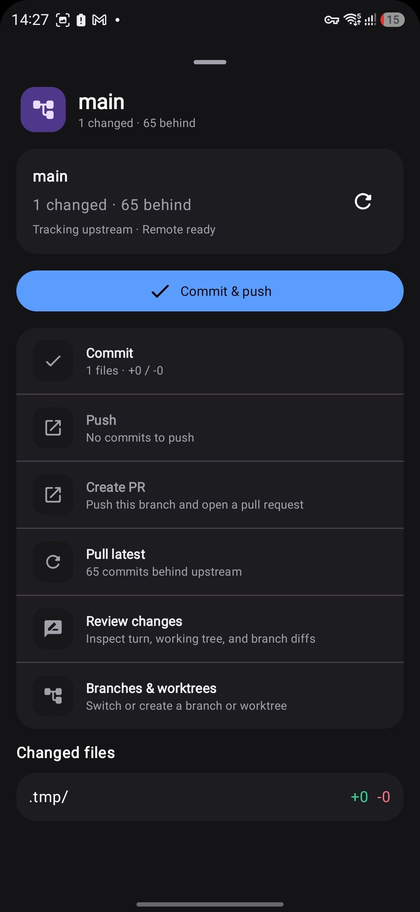
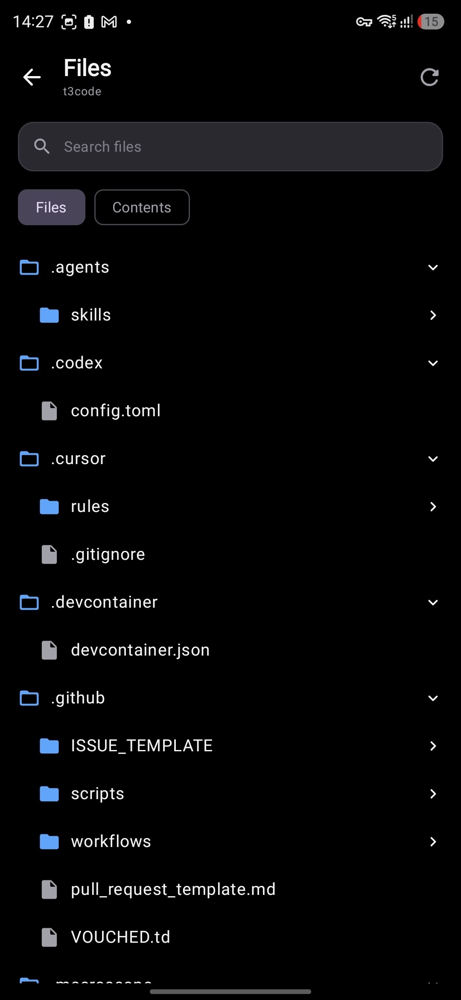
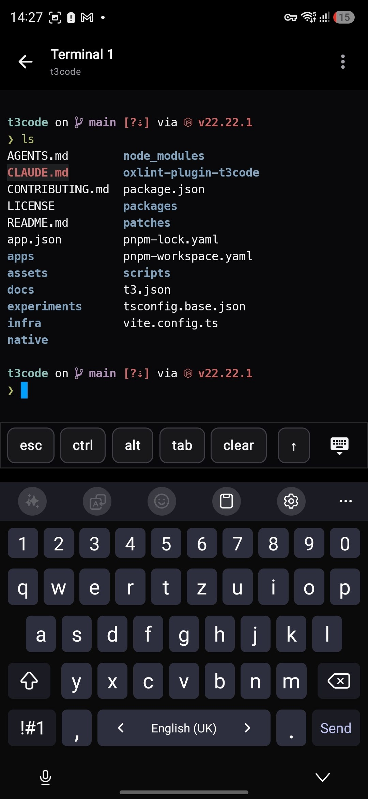

# T3 Code Native for Android

An independent, native Kotlin and Jetpack Compose client for [T3 Code](https://github.com/pingdotgg/t3code). It connects to a compatible T3 server so you can manage coding-agent threads, Git worktrees, files, terminals, reviews, and environments from Android.

> [!IMPORTANT]
> This is an unofficial community project. It is not an official T3 Tools Android release.

## Download

Download the signed universal APK from [GitHub Releases](https://github.com/ahmed-besic/t3code-native-android/releases). Android may ask you to allow installation from your browser or file manager.

[Download v0.7.0 APK](https://github.com/ahmed-besic/t3code-native-android/releases/download/v0.7.0/t3code-native-android-v0.7.0.apk) · [SHA-256 checksum](https://github.com/ahmed-besic/t3code-native-android/releases/download/v0.7.0/t3code-native-android-v0.7.0.apk.sha256)

The app uses the package id `com.t3tools.t3code.native.experimental`. A release APK cannot update over a locally installed debug APK because their signing certificates differ.

## Screenshots

| Home | New task | Thread | Settings |
| --- | --- | --- | --- |
|  |  |  |  |

| Thread actions | Git | Files | Terminal |
| --- | --- | --- | --- |
|  |  |  |  |

## Features

- Direct, remote, and relay environments
- New and existing agent threads with durable drafts and outbox recovery
- Project, branch, and worktree selection
- Workspace files and search
- Git status, commits, branches, and review diffs
- Ghostty-backed terminal sessions
- Image attachments and Android share intake
- Archived threads, usage, appearance, project grouping, and storage controls
- Adaptive phone, tablet, foldable, and Samsung DeX layouts

## Requirements

- Android 8.0 (API 26) or newer
- A compatible T3 Code server
- Java 17 and the Android SDK to build locally

The client follows the current T3 wire contract. Compatibility with arbitrary older server revisions is not guaranteed.

## Build

Clone the repository and run:

```bash
./gradlew :protocol:test :app:testDebugUnitTest :app:assembleDebug :app:lintDebug
```

The debug APK is written to `app/build/outputs/apk/debug/app-debug.apk`.

An unsigned release build can be compiled with:

```bash
./gradlew :app:assembleRelease
```

Release signing is configured only when all four environment variables are present:

```text
T3_ANDROID_KEYSTORE_PATH
T3_ANDROID_KEYSTORE_PASSWORD
T3_ANDROID_KEY_ALIAS
T3_ANDROID_KEY_PASSWORD
```

GitHub Actions stores these as encrypted repository secrets; keys and passwords are never committed.

## Modules

- `:app` — Compose UI, local persistence, environment supervisors, Git/files/terminal/review flows, T3 Connect, and Keystore-backed credentials
- `:protocol` — Effect RPC WebSocket transport, authentication, models, reducers, and commands
- `:terminal-renderer` — Android Canvas terminal renderer, JNI bridge, fonts, and vendored Ghostty ABI libraries
- `:review-renderer` — virtualized Android Canvas diff renderer

## Authentication note

Direct environment pairing works independently. T3 Connect OAuth requires the production Clerk configuration to allow the native callback `clerk://com.t3tools.t3code.native.experimental.callback`.

## Documentation

- [Release readiness](docs/RELEASE_READINESS.md)
- [Settings behavior](docs/SETTINGS_COMPARISON.md)
- [Markdown rendering](docs/MARKDOWN.md)
- [Thread feed](docs/THREAD_FEED.md)
- [Third-party notices](THIRD_PARTY_NOTICES.md)

## License

The project is available under the [MIT License](LICENSE). Vendored terminal libraries and fonts retain their upstream licenses; see [Third-party notices](THIRD_PARTY_NOTICES.md) and [`licenses/`](licenses/).
